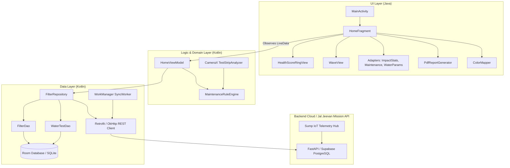

# FilterSaathi (ಫಿಲ್ಟರ್‌ ಸಾಥಿ)
> *"Every drop, verified."* / *"ಪ್ರತಿ ಹನಿ, ಸುರಕ್ಷಿತ."*

FilterSaathi is a government-grade, bilingual (**Kannada + English**) offline-first Android application designed for Gram Panchayats, schools, Anganwadis, Primary Health Centres (PHCs), and lower-level BWSSB (Bangalore Water Supply and Sewerage Board) staff. It enables caretakers and engineers to maintain community RO/UV water filtration plants, sump hygiene, and drinking water quality under the **Jal Jeevan Mission**.

---

## 🏛️ System Architecture & Responsibilities

FilterSaathi implements a dual-language architecture combining **Java (UI Layer)** and **Kotlin (Logic & Data Layer)**:



### 1. Java Layer (UI & Presentation)
- **Activity & Fragments**: `MainActivity` (single activity with Navigation Component), `HomeFragment`, `FiltersFragment`, `CheckFragment`, `TestFragment`, `ReportsFragment`.
- **Custom UI Views**:
  - `HealthScoreRingView`: Animated canvas arc (0-100) reflecting real-time filter health with dynamic color transitions (Aqua -> Amber -> Red).
  - `WaveView`: Animated sinusoidal fluid wave symbolizing water flow on the hero card.
- **Adapters**: `ImpactStatsAdapter`, `MaintenanceAdapter`, `WaterParamsAdapter`.
- **Utilities**: `PdfReportGenerator` (A4 Jal Jeevan Mission certificate generator) and `ColorMapper`.

### 2. Kotlin Layer (Data, Hardware & Domain Rules)
- **Room Persistence**: `AppDatabase`, `FilterDao`, `WaterTestDao`, `FilterEntity`, `WaterTestReadingEntity`.
- **State Management**: `HomeViewModel` exposing `LiveData` and Coroutines for background tasks.
- **Hardware Integration**: CameraX `TestStripAnalyzer` with real-time RGB swatch extraction and standard chemical mapping (pH, Free Chlorine, Nitrate, Hardness).
- **Rule Engine**: `MaintenanceRuleEngine` with `@JvmStatic` calculation logic for Jal Jeevan Mission IS 10500 standards.
- **Dependency Injection**: Google Hilt modules (`AppModule`).
- **Offline Sync**: WorkManager `SyncWorker` providing automatic background synchronization when internet connectivity resumes.

---

## 📱 Home Screen Features (Top to Bottom)

1. **Header Bar**:
   - Indian Tricolour decorative accent strip (`#FF9933`, `#FFFFFF`, `#138808`).
   - Official FilterSaathi vector logo (water droplet + verification checkmark + circular filter rim).
   - Instant **EN / ಕನ್ನಡ** bilingual switcher (dynamically adjusts locale and updates string resources).
   - Notification bell with unread badge counter.
   - Gram Panchayat location selector chip (e.g., *Hosahalli Gram Panchayat*).
2. **Hero Card**:
   - Filter Health Score ring (0-100 gauge).
   - Status diagnosis (*Good / Attention Needed / Critical*).
   - Trend tracking (*+4% since last month*).
3. **Alert Banner**:
   - Critical warning banner highlighting urgent component failure (e.g. Anganwadi RO-2 membrane blocked).
   - One-tap "Fix Now" and dismiss controls.
4. **Quick Actions (2x2 Grid)**:
   - **Start Check**: Photo checklist for daily caretaker inspections.
   - **Scan Strip**: CameraX test strip colour analyzer.
   - **Report Fault**: Incident logging with GPS coordinates for PHC/BWSSB technicians.
   - **Request Sump**: Order IoT sump sensor unit.
5. **Community Impact Stats (Horizontal RecyclerView)**:
   - Operational filters (*14 / 16*).
   - Safe water dispensed (*42,500 L*).
   - Average repair turnaround (*1.8 hrs*).
   - Unsafe readings (*0 this week*).
6. **Sump Monitoring Card**:
   - 3-step timeline: Request -> Technician Visit -> Live Purity.
   - Status badge (*Requested / Scheduled / Installed*).
   - Direct installation booking button.
7. **Upcoming Maintenance**:
   - Sediment Cartridge, UV Lamp, RO Membrane with days remaining and progress bars.
8. **Latest Water Test**:
   - Parameters: TDS, pH, Chlorine, Nitrate with Safe / Watch / Unsafe tags.
9. **Monthly Water Audit Report**:
   - Instant preview of September 2026 PDF audit.
   - One-click share to village WhatsApp groups.
10. **Help Strip**:
    - Direct toll-free helpline caller (`1800-JJ-WATER`).
    - Dedicated voice assistant trigger for low-literacy caretakers.
11. **Bottom Navigation**:
    - Home, Filters, Check, Test, Reports.

---

## 🎨 Design System

| Element | Specification | Hex / Value |
|---|---|---|
| **Primary Navy** | App bar, deep surfaces, typography | `#0F2A5C` |
| **Secondary Blue** | Header transitions, active chips | `#1D4896` |
| **Aqua Accent** | Hero gradient, health ring, icons | `#14B8D4` |
| **Saffron Accent** | Primary Call-to-Action buttons (WCAG compliant) | `#EA7A12` |
| **Success** | Safe water status, normal parameters | `#18803A` |
| **Warning** | Attention needed, maintenance due | `#D99A0B` |
| **Danger** | Contamination alerts, urgent repairs | `#C62828` |
| **Background** | Clean neutral light surface | `#F3F6FB` |
| **Card Radius** | Rounded corners (MaterialCardView) | `16dp` / `20dp` |
| **Touch Target** | Accessibility compliance | >= `48dp` |

---

## ♿ Accessibility & Inclusivity

- **WCAG AA Compliance**: High-contrast colour palette adhering to contrast ratios.
- **Multimodal Status**: Status indicators are never communicated by colour alone; badges pair explicit text tags (`Safe`, `Watch`, `Unsafe`) and icons.
- **TalkBack Ready**: All interactive buttons, icons, and custom views declare explicit `contentDescription` attributes in English and Kannada.
- **Low-Literacy First**: Prominent visual icons, color coding, and one-tap voice-note help strip for village caretakers.

---

## 🚀 Setup & Build Instructions

### Prerequisites
- Android Studio Iguana / Jellyfish or newer.
- JDK 17 (recommended: Eclipse Temurin 17).
- Android SDK Platform 34 (Android 14) with Build-Tools 34.0.0.

### Build via Command Line
```bash
# Clone the repository
git clone https://github.com/Manushree-S/Filter_Saathi.git
cd Filter_Saathi

# Build Debug APK
./gradlew assembleDebug

# Run Unit Tests
./gradlew testDebugUnitTest

# Run Android Lint
./gradlew lintDebug
```

---

## 🔄 CI/CD Pipelines

The repository includes GitHub Actions workflows configured in `.github/workflows/`:
1. `android-ci.yml`:
   - Runs automatically on pull requests and pushes to `main` and `develop`.
   - Sets up JDK 17 with Gradle caching.
   - Executes linting, runs unit tests, builds the debug APK, and archives the APK as an artifact.
2. `release.yml`:
   - Triggers on version tags (`v*`).
   - Builds signed release APKs and Android App Bundles (`.aab`) using repository secrets (`RELEASE_KEYSTORE_BASE64`).
   - Creates a GitHub Release with the built binaries attached.

---

## 🌿 Git Branching Strategy & Conventions

- `main`: Production-ready releases.
- `develop`: Integration branch for active feature development.
- `feature/<name>`: Feature branches created from `develop` and merged via PR.
- **Conventional Commits**:
  - `feat: add bilingual HomeFragment with custom health score ring`
  - `fix: resolve locale refresh on Kannada toggle`
  - `docs: update architecture diagrams and setup instructions`
  - `chore: update dependencies and version catalog`
